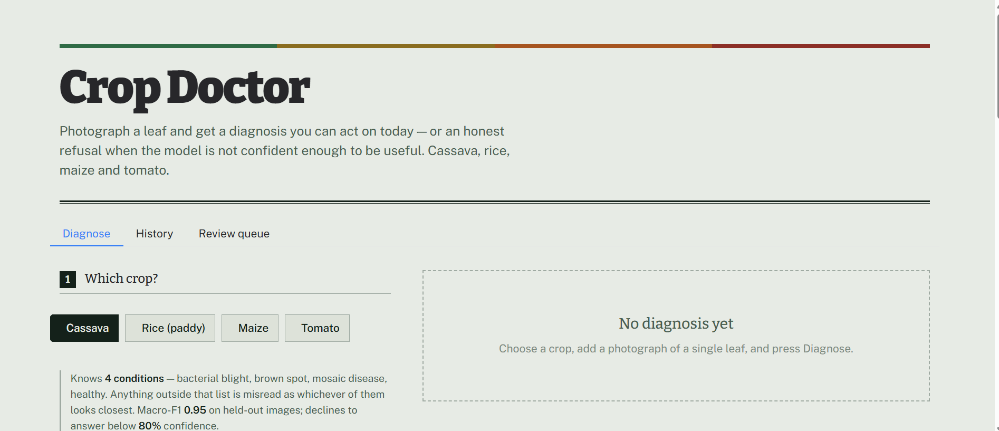
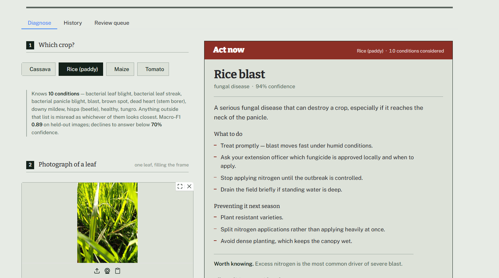
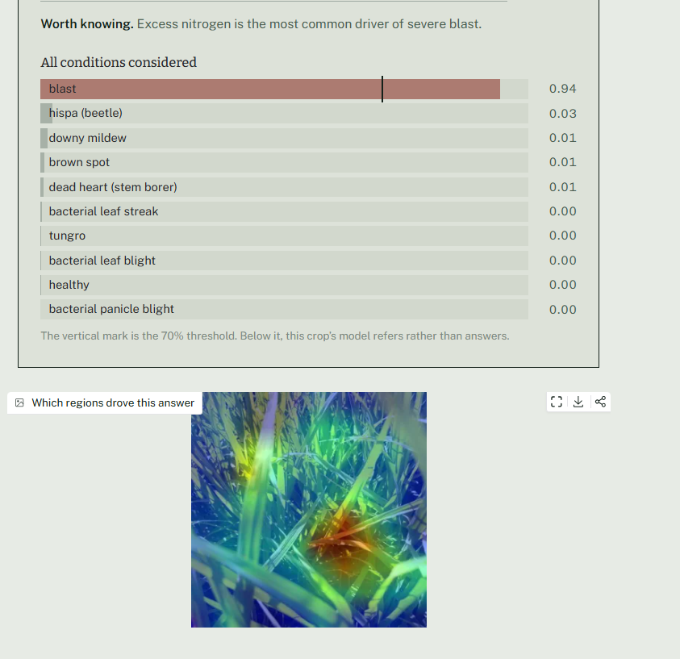
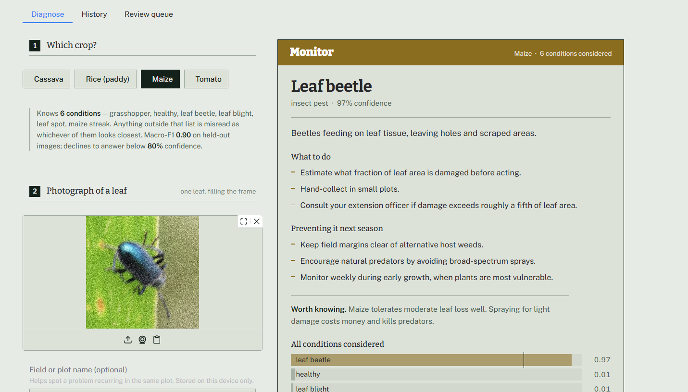
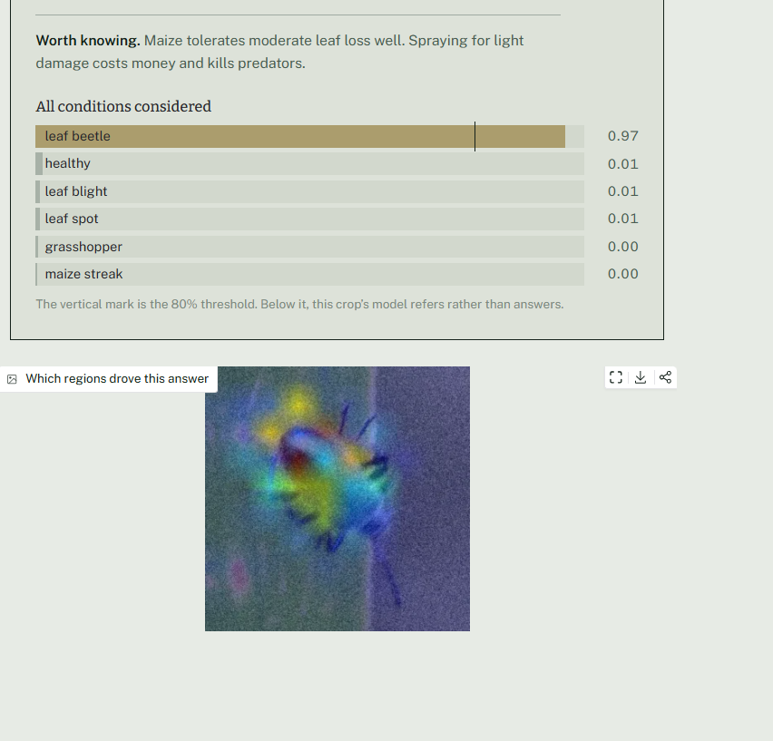
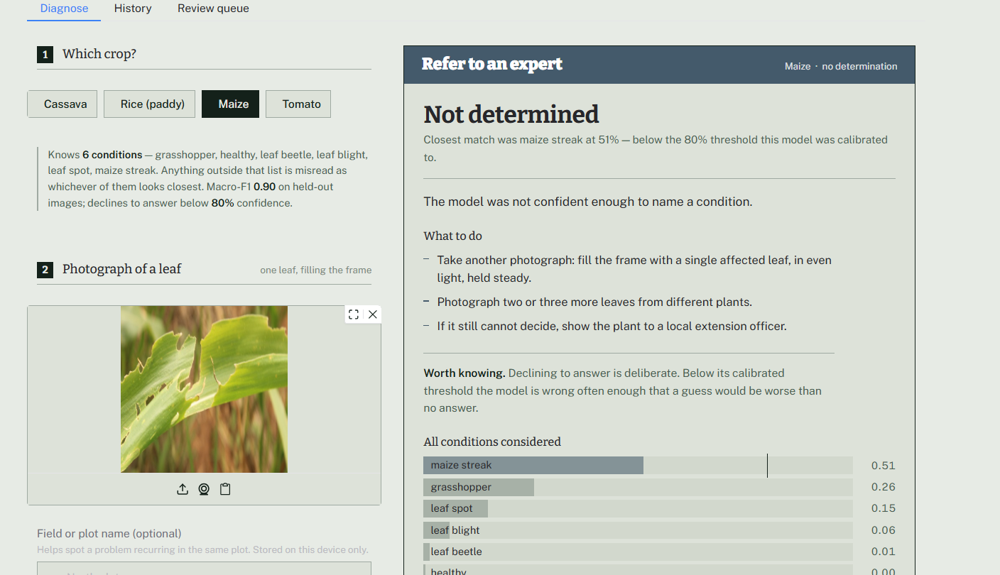
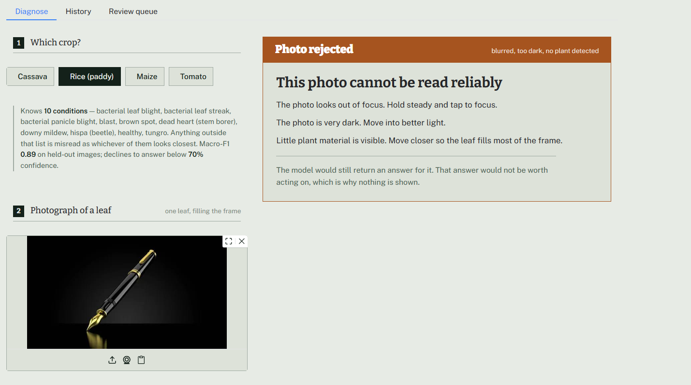
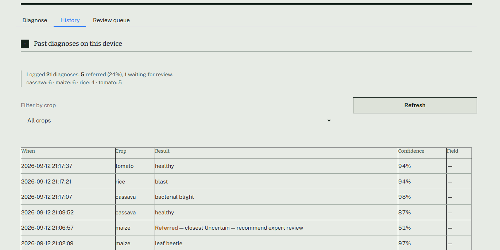
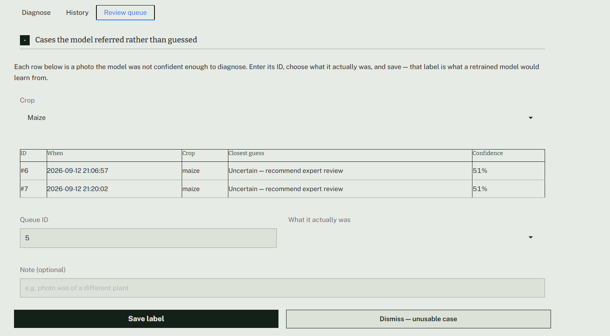

# Crop Doctor

An image-based diagnostic tool for cassava, rice, maize, and tomato. A user photographs a leaf, selects the crop, and receives a condition, an urgency level, and treatment guidance — or a calibrated refusal when the model's confidence is too low to act on.



## Motivation

Most publicly available plant disease classifiers are trained and evaluated on PlantVillage, a lab dataset of detached leaves photographed against a uniform grey background. Models trained on this data commonly report 97-99% accuracy. This project began the same way: an EfficientNetV2-S model reached 97.9% accuracy on a PlantVillage tomato test set.

A follow-up test — evaluating the same model on real field photographs — returned 33% accuracy.

That 65-point gap is the reason this project is structured the way it is. The core engineering problem was not building a classifier; that part is well understood. The problem was determining which reported accuracy figures reflect genuine disease recognition and which reflect artifacts of how a dataset was collected, then building models and diagnostics that hold up under scrutiny. Every design decision below — dataset selection, the abstention mechanism, the background-dependence diagnostic — follows from treating that distinction as the central technical requirement of the project.

## What it does

Given a crop selection and a leaf photograph, the application returns:

- **A diagnosis and an urgency level** — act now, act this week, monitor, or no action needed — rather than a bare class label.
- **A confidence-based abstention.** Below a threshold calibrated per crop on validation data, the system returns a referral rather than a guess. A confident, incorrect diagnosis has a higher cost than an honest "refer to an expert."
- **A Grad-CAM attention map** showing which regions of the image drove the prediction. This diagnostic identified two models in this project that were making correct predictions for the wrong reasons (detailed below).
- **Condition-specific guidance**, differentiated by type — fungal, bacterial, viral, or insect — since the appropriate response differs by category.

A local history log and a review queue handle referred cases, so a low-confidence prediction has a defined downstream path rather than being discarded.

## The four models, honestly

| Crop | Classes | Macro-F1 | Refers below | Background dependence |
|---|---|---|---|---|
| Cassava | 4 | 0.954 | 80% confidence | 6.1 pts |
| Rice | 10 | 0.888 | 70% confidence | not measured |
| Maize | 6 | 0.896 | 80% confidence | 4.6 pts |
| Tomato | 5 | 0.802 | 70% confidence | 14.5 pts |

Tomato has the lowest score of the four, and this is reported without adjustment. Verticillium wilt and leaf blight present similarly on a single leaf image — differentiating them typically requires observing symptom progression across the plant, which a single photograph cannot capture. A lower, defensible figure is preferable to a higher figure obtained by a less rigorous evaluation.

Background dependence is defined and discussed in the following section. It is arguably the most informative metric in this table, since it indicates how much of the reported accuracy reflects genuine disease recognition versus dataset artifacts.

## Background dependence: the central diagnostic

An initial tomato classifier was trained on PlantVillage using a standard fine-tuning approach and evaluated at 0.9788 accuracy on its own held-out test split — a result consistent with published work using this dataset.

To assess what the model was actually responding to, a diagnostic test was run: test images were held fixed except for their backgrounds, which were replaced with procedurally generated noise. Leaf pixels were unmodified.

Accuracy dropped by 29.8 points. A meaningful share of the model's apparent performance was attributable to the photographic background rather than to features of the leaf.

This result determined the dataset strategy for the remainder of the project. None of the four production models are trained on PlantVillage or other studio-style datasets. Instead, models were trained on field-captured collections — Paddy Doctor (Tamil Nadu), a farmer-photographed cassava dataset (Uganda), and CCMT (Ghana) — and the background-substitution test was applied to every subsequent model as a standard validation step:

| Model | Dataset type | Background dependence |
|---|---|---|
| PlantVillage tomato (rejected) | Studio, uniform background | 29.8 pts |
| Maize, alternate source (rejected) | Studio, mixed provenance | 32.4 pts |
| CCMT tomato (production) | Field-captured | 14.5 pts |
| Cassava (production) | Field-captured | 6.1 pts |
| CCMT maize (production) | Field-captured | 4.6 pts |

The pattern is consistent across five models and three crops: studio-collected data shows roughly 30 points of background dependence; field-collected data shows under 15. This is treated as a reliability indicator that should be reported alongside any accuracy figure, not as a one-off finding.

Grad-CAM visualizations corroborated this independently. In the PlantVillage model, attention frequently localized to the grey background card rather than the leaf, even on correctly classified examples. A separate maize model, evaluated at 0.986 accuracy, was found to attend to black corner artifacts introduced by a rotation-augmentation step in its training data. Neither issue was visible from the accuracy metric alone.

## Additional data quality findings

**Resolution as an unintended class signal.** One evaluated maize dataset contained four disease classes at a uniform 256×256 resolution and a fifth class, insect damage, at 450×600. This allows a model to separate that class by image dimensions alone, independent of visual content. The class was excluded rather than retained with an inflated score.

**Dataset validation status does not guarantee file integrity.** The CCMT collection, used for the production maize and tomato models, is described as expert-validated. It nonetheless contained three distinct classes of corrupted files: files that failed to open, files that opened but failed on pixel decoding, and files that one decoder accepted while TensorFlow's JPEG decoder rejected. Each required a separate validation step to detect.

**Confidence calibration is data-dependent, not a tuning parameter.** The abstention mechanism is effective because there is a measurable separation between confidence-when-correct and confidence-when-incorrect — 0.29 for cassava, similarly wide margins for the other production models. In the rejected PlantVillage model, this separation was only 0.06, meaning no threshold choice could have produced a useful abstention policy. Calibration cannot compensate for a model that has not learned the intended features.

## Running it

```
git clone https://github.com/kaushiksridhar17/crop-doctor.git
cd crop-doctor
python -m venv venv
venv\Scripts\activate        # macOS/Linux: source venv/bin/activate
pip install -r requirements.txt
python scripts/download_models.py
python src/app.py
```

The download script pulls the four trained models (~500 MB total) from this repo's GitHub Release — they're not tracked in git because GitHub caps individual files at 100 MB.

## Known limitations

**Closed-set classification per crop.** Each model recognizes only the conditions present in its training data. A rice leaf affected by sheath blight — not in the training set — will be classified as one of the ten known conditions rather than flagged as unrecognized. The abstention threshold mitigates this only when the resulting confidence is low; a closed-set model can still be confidently wrong about an out-of-distribution input.

**The quality gate is a heuristic, not an object detector.** It evaluates blur, exposure, and a color/saturation-based estimate of vegetation coverage. During testing, an image of a pair of dice passed this check, likely because its color and lighting satisfied the vegetation heuristic. The gate reliably filters low-quality photographs; it does not verify that the subject is a plant.

**Treatment guidance has not undergone professional review.** Content was compiled from general agronomic references (ICAR- and TNAU-style extension material) and is not a substitute for professional diagnosis. No specific chemical products are named, since approved products vary by jurisdiction; all guidance defers to a local agricultural extension officer for product-level recommendations.

**The background-dependence diagnostic was not run for rice.** This test was introduced after the rice model was trained. The other three production models include this measurement; rice does not.

## What's under the hood

```
src/
    registry.py    every crop's model path, thresholds, and metadata in one place
    quality.py     rejects unusable photos before they reach a model
    predict.py     inference and the abstain logic
    gradcam.py     attention maps — the thing that caught the cheating models
    advice.py      treatment guidance, validated against what the models can output
    storage.py     local history and the review queue
    app.py         the interface
data/
    advice.json    the guidance content, separate from code so it can be reviewed on its own
results/           the actual numbers behind every claim above — test metrics, calibration
                   sweeps, background diagnostics, one folder per crop
notebooks/         the four training notebooks, as documentation more than as a run-it-yourself path
docs/screenshots/  the app in use
```

Every model is EfficientNetV2-S, fine-tuned in two phases — head first with the backbone frozen, then the top of the backbone unfrozen at a much lower learning rate. Splits are deduplicated by both exact and perceptual hash before training, because more than one of these datasets turned out to contain near-duplicate images that would otherwise leak across train and test.

## A few screenshots

**A confident, urgent result:**




**Something less urgent:**




**The model declining to guess:**



**A photo it correctly won't touch:**



**History and the review queue:**




## Planned work

- **Containerization**, for environment-independent reproducibility.
- **TFLite export for on-device inference.** Float16 conversion of the tomato model reduced size to 13.5 MB with no measurable accuracy loss; int8 quantization was also tested and rejected after a substantial accuracy collapse, which is documented in `results/`.
- **Background-dependence measurement for the rice model**, to complete the diagnostic across all four crops.
