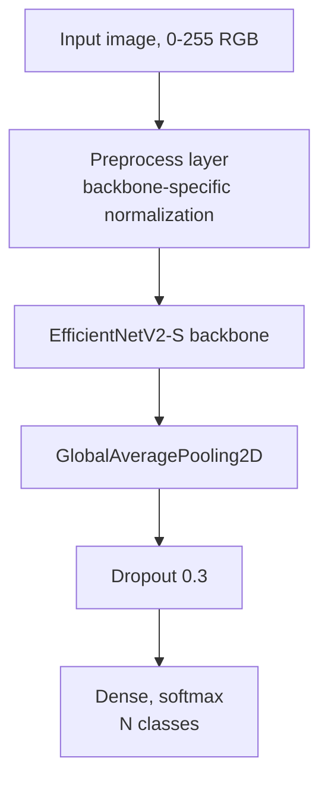
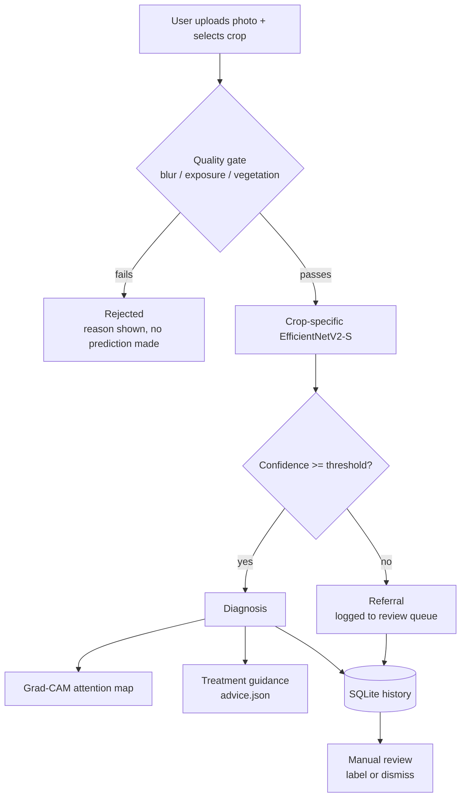

# Crop Doctor

Image-based disease diagnosis for four crops — cassava, rice, maize, tomato. A user selects a crop, uploads a leaf photograph, and receives a condition, an urgency level, treatment guidance, and a Grad-CAM attention map. Predictions below a per-crop confidence threshold are returned as a referral rather than a diagnosis.


---

## Datasets

| Crop | Source | Images | Classes | Collection |
|---|---|---|---|---|
| Cassava | [Kaggle: gihozopatrick/cassava-dataset](https://www.kaggle.com/datasets/gihozopatrick/cassava-dataset) | 13,187 | 4 | Field |
| Rice | [Paddy Doctor](https://www.kaggle.com/c/paddy-disease-classification) | 10,407 | 10 | Field, Tamil Nadu |
| Maize | [CCMT](https://www.kaggle.com/datasets/irakozekelly/crop-pest-and-disease-dataset) (raw split) | 5,358 → 4,753 after cleaning | 6 | Field, Ghana |
| Tomato | [CCMT](https://www.kaggle.com/datasets/irakozekelly/crop-pest-and-disease-dataset) (raw split) | 5,805 | 5 | Field, Ghana |

All four were selected after rejecting studio-photographed alternatives (PlantVillage and a curated maize collection) — see **Background-dependence diagnostic** below.

---

## Architecture

**Model.** EfficientNetV2-S per crop, ImageNet-initialized, fine-tuned in two phases.



**Application pipeline.** One model per crop; the crop is selected by the user, not inferred.



**Grad-CAM.** The backbone is split into three pieces at inference time — preprocessing layers, backbone-to-last-conv-layer, and the classification head — because the backbone is a nested Functional model and its internal layer outputs are not directly addressable from the outer model. A gradient tape run against the manually reconstructed forward pass yields the attention map.

---

## Model results

| Crop | Backbone | Input size | Macro-F1 | Abstain threshold | Refers | Background dependence |
|---|---|---|---|---|---|---|
| Cassava | EfficientNetV2-S | 320px | 0.954 | 0.80 | 7% | 6.1 pts |
| Maize | EfficientNetV2-S | 320px | 0.896 | 0.80 | 23% | 4.6 pts |
| Rice | EfficientNetV2-S | 320px | 0.888 | 0.70 | 27% | 18.8 pts |
| Tomato | EfficientNetV2-S | 400px | 0.802 | 0.70 | 28% | 14.5 pts |

Full metrics, per-class breakdowns, and calibration sweeps are in `results/<crop>/`.

---

## Background-dependence diagnostic

**Method.** Test images are evaluated twice: once unmodified, once with the background replaced by procedural noise while leaf pixels are left unchanged. The accuracy difference is attributable to background alone.

**Result on an initial PlantVillage-trained tomato model:**

| | Accuracy |
|---|---|
| Original test set | 0.9788 |
| Test set, background replaced | 0.6805 |
| **Drop** | **29.8 pts** |

This result excluded PlantVillage and comparable studio-photographed datasets from the rest of the project. All four production models are trained on field-captured data and evaluated with the same diagnostic:

| Model | Data type | Drop |
|---|---|---|
| PlantVillage tomato (rejected) | Studio | 29.8 pts |
| Alternate maize source (rejected) | Studio, mixed | 32.4 pts |
| Rice | Field | 18.8 pts |
| Tomato (CCMT) | Field | 14.5 pts |
| Cassava | Field | 6.1 pts |
| Maize (CCMT) | Field | 4.6 pts |

Rice shows the highest dependence among production models. Per-class breakdown (`results/rice/rice_background.json`) shows the largest drops on dead heart (41.1 pts) and blast (29.2 pts); tungro is least affected (1.3 pts), consistent with its distinct whole-leaf discoloration.

---

## Application features

- **Per-crop models.** One model per crop, selected by the user. Prevents cross-crop misclassification and allows independent evaluation per model.
- **Confidence-based abstention.** Threshold fitted on validation data per crop. Below threshold, the result is a referral, logged to a review queue.
- **Grad-CAM.** Attention overlay on every prediction. Used during development to identify two models attending to background artifacts rather than leaf features (see diagnostic above).
- **Photo quality gate.** Rejects images below a blur/exposure/vegetation-coverage threshold before classification. Thresholds are calibrated per crop from each dataset's measured distribution.
- **Treatment guidance.** Condition-specific, differentiated by type (fungal / bacterial / viral / insect). No product names — guidance defers to local agricultural extension officers, since approved products vary by region.
- **Local history and review queue.** SQLite-backed. Referred cases retain their image for manual labeling; confirmed labels update the diagnosis record.

---

## Setup

```bash
git clone https://github.com/kaushiksridhar17/crop-doctor.git
cd crop-doctor
python -m venv venv
venv\Scripts\activate        # macOS/Linux: source venv/bin/activate
pip install -r requirements.txt
python scripts/download_models.py
python src/app.py
```

`download_models.py` fetches four trained models (~500 MB) from this repository's GitHub Release. Models are not tracked in git — GitHub's 100 MB per-file limit does not accommodate them.

---

## Repository structure

```
src/
    registry.py    per-crop model paths, thresholds, metadata
    quality.py     photo quality gate
    predict.py     inference, abstention logic
    gradcam.py     attention maps
    advice.py      treatment guidance, validated against model outputs
    storage.py     history and review queue (SQLite)
    app.py         Gradio interface
data/
    advice.json    treatment guidance content
notebooks/         training notebooks (Colab), one per crop
results/           test metrics, calibration sweeps, background diagnostics
docs/screenshots/  application screenshots
scripts/
    download_models.py    fetches trained models from GitHub Release
    verify_models.py      loads all four models, checks shapes and inference
```

---

## Training

Each crop was trained independently in Colab: EfficientNetV2-S, ImageNet-initialized, two-phase fine-tuning (frozen backbone, then top-of-backbone unfrozen at a reduced learning rate). Data pipeline: index → deduplicate (exact + perceptual hash) → split → augment (train only).

Notebooks are in `notebooks/`, one per crop, including dataset download, cleaning, training, evaluation, calibration, and the background-dependence diagnostic.

Dataset-specific issues identified and corrected during training:

- **Cassava**: provided train/valid/test split audited for cross-split duplicates via perceptual hash; contamination found and removed from the training split only.
- **Maize (CCMT)**: one class (insect damage) excluded — image resolution differed from the other classes (450×600 vs. 400×400), which would let a model separate it by file dimensions rather than content. 320 further images dropped for resolution mismatch or file corruption; three corruption types identified (unreadable header, corrupt pixel data, files rejected by TensorFlow's decoder but not by Pillow).
- **Tomato (CCMT)**: retrained at 400px after an initial 320px run scored 0.740; the two weakest classes (verticillium wilt, leaf blight) are distinguished partly by symptom progression across the plant, which a single leaf image does not capture.
- **Rice**: 10,407 images, 10 classes including insect pests (dead heart, hispa) alongside fungal, bacterial, and viral disease.

---

## Known limitations

- **Closed-set per crop.** A condition not present in a crop's training data is classified as the nearest known condition, not flagged as unrecognized.
- **Quality gate is heuristic, not object detection.** Vegetation-coverage check is color/saturation-based. Verified to occasionally misclassify non-plant objects with plant-like coloration.
- **Treatment guidance is unreviewed.** Compiled from general agronomic references (ICAR/TNAU-style extension material), not verified by a plant pathologist.

---

## Screenshots

**Result — high urgency:**


**Result — low urgency:**


**Result — below confidence threshold:**


**Quality gate rejection:**


**History and review queue:**


---

## Planned

- Docker packaging
- TFLite export (tested on tomato: float16 → 13.5 MB, no measured accuracy loss; int8 tested and rejected — see `results/tomato/`)
